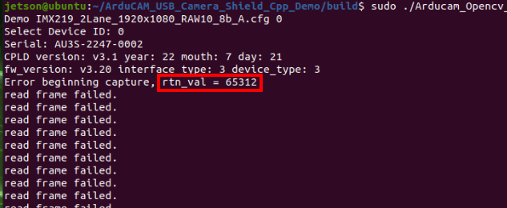

# Instructions

## Install USB Driver

### Linux

Execute the installation script to set udev rules. so that the system can recognize the USB device.

1. [Download Script](https://github.com/ArduCAM/ArduCAM_USB_Camera_Shield/releases/download/install_drivers/configure_udev_rules.sh)
2. Execute the following command:
```
chmod +x ./configure_udev_rules.sh
./configure_udev_rules.sh
```

**Note: After configuring the udev rules, you need to replug the device or restart the PC, otherwise you still need `sudo` to run the program.**

### Windows

1. [Download Driver](https://github.com/ArduCAM/ArduCAM_USB_Camera_Shield/releases/download/install_drivers/install_USB_Camera_Drivers.zip)
2. Unzip the package.
3. Double-click the install_Drivers.bat file in the execution package.

## Install dependencies

### Arducam Library
```
python3 -m pip install -U pip
python3 -m pip install arducam_config_parser ArducamSDK
```
### OpenCV
```
python3 -m pip install opencv-python numpy
```
**Note: For Jetson no need to install OpenCV dependencies**

## Download Code
```shell
git clone https://github.com/ArduCAM/ArduCAM_USB_Camera_Shield_Python_Demo.git
cd ArduCAM_USB_Camera_Shield_Python_Demo
```

## Run the Demo
```shell
python3 ArduCam_Demo.py -v --preview-width 1280 -f <path for camera cfg>
```
## Parameters
- -v: Whether to display camera information.
- --preview-width: Sets the width of the preview screen.
- -f: Specify the camera config file.

## Example
```shell
python3 ArduCam_Demo.py -v --preview-width 1280 -f IMX477/4032x3040/IMX477_2Lane_4032x3040_RAW8_A.cfg
```

**Note: Configuration files can be found here: [ArduCAM_USB_Camera_Shield](https://github.com/ArduCAM/ArduCAM_USB_Camera_Shield/tree/master/Config)**

## Troubleshooting

When using the camera under **Linux**, there may be `Error beginning capture, rtn_val = 65312`



This error may be caused by insufficient buffer of usbfs. You can solve this problem by increasing usbfs_memory_mb,

Example:
Set usbfs_memory_mb to 32 (default 16)
```
sudo sh -c 'echo 32 > /sys/module/usbcore/parameters/usbfs_memory_mb'
```
